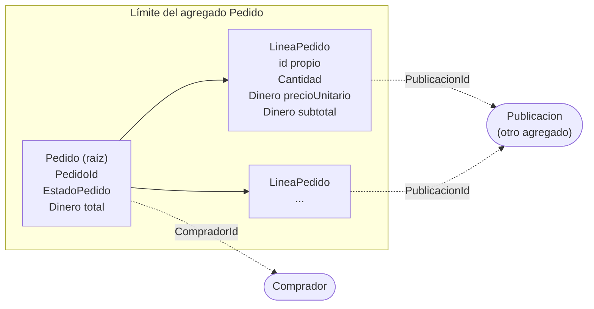

# Invariantes del agregado PedidoMascotas

1. Un pedido confirmado siempre debe contener al menos un producto.
2. Todos los productos del pedido siempre deben estar destinados exclusivamente a perros o gatos.
3. La cantidad de cada producto siempre debe ser mayor que cero y no puede superar el stock disponible.
4. El total del pedido siempre debe ser igual a la suma de los subtotales de sus productos.
5. Un pedido enviado, entregado o cancelado nunca puede modificar sus productos ni sus cantidades.

En código el agregado se llama [Pedido](ecommerce/src/main/java/com/uniquindio/ecommerce/domain/pedido/Pedido.java) y cada producto del pedido es una [LineaPedido](ecommerce/src/main/java/com/uniquindio/ecommerce/domain/pedido/LineaPedido.java).

## Diagrama del agregado Pedido

- **Raíz:** `Pedido`. Es la única puerta de entrada: las líneas se agregan, cambian o quitan solo a través de sus métodos (`agregarLinea`, `cambiarCantidad`, `quitarLinea`, `confirmar`, `cancelar`).
- **Dentro del límite:** las `LineaPedido` y los value objects `Cantidad`, `Dinero` y `EstadoPedido`. Desde afuera las líneas solo se pueden leer (`getLineas()` devuelve una copia).
- **Fuera del límite:** el comprador y la `Publicacion`. El pedido solo guarda sus identificadores (`CompradorId`, `PublicacionId`), no los objetos.

# Invariantes del agregado Publicacion

1. El precio siempre debe ser mayor a cero.
2. La especie destino siempre es PERRO o GATO (nunca null).
3. Una publicación PUBLICADA debe tener stock de al menos 1; si el stock llega a 0 pasa a AGOTADA.
4. Una publicación RETIRADA es un estado final: no vuelve a PUBLICADA ni acepta pedidos.

Se protegen en [Publicacion.java](ecommerce/src/main/java/com/uniquindio/ecommerce/domain/publicacion/Publicacion.java).
